# 🃏 NoirCard Protocol: Build Privacy-First Business Cards with Zero-Knowledge Proofs

## 🎯 What You'll Build
In this comprehensive tutorial, you'll create **NoirCard** - a revolutionary privacy-preserving business card system that solves the networking paradox: How do you connect professionally while protecting your personal information from harassment and spam?

**Tutorial Duration:** 45 minutes  
**Skill Level:** Intermediate  
**Prerequisites:** Basic JavaScript/TypeScript knowledge

## 🚀 Why NoirCard Matters

### The Problem
Every year, millions of professionals face a dilemma:
- **Share contact info** → Risk harassment, spam, and privacy invasion
- **Don't share** → Miss valuable connections and opportunities

### Our Solution
NoirCard uses Midnight's zero-knowledge proofs to create:
- 🔐 **Privacy-preserving contacts** with progressive reveal
- 💰 **Economic accountability** through abuse bonds
- 🎭 **Pseudonymous handles** for initial contact
- ⚡ **Instant revocation** if things go wrong

## 📚 Table of Contents
1. [Environment Setup](#1-environment-setup)
2. [Understanding the Architecture](#2-understanding-the-architecture)
3. [Writing Your First ZK Circuit](#3-writing-your-first-zk-circuit)
4. [Building the Smart Contract](#4-building-the-smart-contract)
5. [Implementing Progressive Reveal](#5-implementing-progressive-reveal)
6. [Adding Abuse Prevention](#6-adding-abuse-prevention)
7. [Creating the Frontend](#7-creating-the-frontend)
8. [Testing with Real Scenarios](#8-testing-with-real-scenarios)
9. [Advanced Features](#9-advanced-features)
10. [Production Deployment](#10-production-deployment)

---

## 1. Environment Setup

### Step 1.1: Clone and Install
```bash
# Clone the repository
git clone https://github.com/bytewizard42i/NoirCard.git
cd NoirCard

# Install dependencies
npm install

# Copy environment configuration
cp .env.example .env
```

### Step 1.2: Start Local Midnight Infrastructure
```bash
# Start Midnight proof server, local node, and Redis
docker-compose up -d

# Verify services are running
docker-compose ps

# Expected output:
# NAME                     STATUS    PORTS
# midnight-proof-server    running   0.0.0.0:6300->6300/tcp
# midnight-node           running   0.0.0.0:9944->9944/tcp
# noircard-redis          running   0.0.0.0:6379->6379/tcp
```

### Step 1.3: Compile Contracts
```bash
# Install Midnight Compact compiler
npm install -g @midnight-ntwrk/compact-compiler@0.16.0

# Compile the NoirCard Protocol contract
cd contracts/
midnightc compile NoirCardProtocol.compact --output build/

# You should see:
# ✓ Parsing contract...
# ✓ Generating ZK circuits...
# ✓ Contract compiled successfully
```

---

## 2. Understanding the Architecture

### The Privacy Model
NoirCard implements a three-layer privacy model:

```typescript
// Layer 1: Public Metadata (On-chain)
{
  cardId: "0xabc...",     // Unique identifier
  isActive: true,         // Card status
  requiresBond: true,     // Spam protection enabled
  minBondAmount: "3"      // Minimum stake required
}

// Layer 2: Commitments (On-chain, but private)
{
  aliasHash: hash("Sarah@DevCon2025"),        // Hashed alias
  phoneCommit: commit("+1-555-XXXX", secret), // Phone commitment
  emailCommit: commit("sarah@XXXX", secret)   // Email commitment
}

// Layer 3: Actual Data (Off-chain, progressively revealed)
{
  level1: { name: "Sarah Chen" },
  level2: { name: "Sarah Chen", company: "TechCorp" },
  level3: { name: "Sarah Chen", company: "TechCorp", email: "sarah@techcorp.com" }
}
```

### Zero-Knowledge Proof Flow

```mermaid
graph LR
    A[Private Input] --> B[ZK Circuit]
    B --> C[Proof]
    C --> D[Verifier]
    D --> E[✓ Valid]
    
    style A fill:#ff6b6b
    style C fill:#4ecdc4
    style E fill:#95e77e
```


---

## 3. Writing Your First ZK Circuit

Let's create a simple circuit that proves you own a card without revealing your identity:

### Step 3.1: Basic Authorization Circuit
```typescript
// contracts/circuits/Authorization.compact

import "CompactStandardLibrary" as std;

// Prove you're the card admin without revealing your secret
export circuit proveCardOwnership(
    cardId: Bytes<32>,
    adminSecret: Bytes<32>  // Private witness
): Bool {
    // Derive adminId from secret (one-way function)
    let adminId = std::crypto::hash(adminSecret, "ADMIN_ID");
    
    // Check if this adminId matches the card's admin
    let storedAdminId = ledger::get(card_admins, cardId);
    
    // Return proof of ownership
    return adminId == storedAdminId;
}
```

### Step 3.2: Testing the Circuit
```typescript
// tests/authorization.test.ts

import { generateProof, verifyProof } from '@midnight-ntwrk/midnight-js-sdk';

describe('Authorization Circuit', () => {
    it('should prove ownership without revealing secret', async () => {
        const cardId = '0xabc...';
        const adminSecret = 'my-secret-key';
        
        // Generate proof
        const proof = await generateProof('proveCardOwnership', {
            cardId,
            adminSecret  // This stays private!
        });
        
        // Verify proof on-chain
        const isValid = await verifyProof(proof);
        expect(isValid).toBe(true);
        
        // Secret is never revealed
        expect(proof).not.toContain(adminSecret);
    });
});
```

---

## 4. Building the Smart Contract

### Step 4.1: Core Card Creation
```typescript
// contracts/NoirCardProtocol.compact (simplified)

export circuit createCard(
    aliasHash: Bytes<32>,
    requiresBond: Bool,
    minBondAmount: Uint<64>,
    phoneCommit: Bytes<32>,
    emailCommit: Bytes<32>
): Bytes<32> {
    // Generate unique card ID
    let cardId = generateCardId();
    
    // Store public metadata
    cards = cards.add(cardId);
    card_states = card_states.add((cardId, CardState::ACTIVE));
    card_policies = card_policies.add((
        cardId, requiresBond, minBondAmount, 86400, 3
    ));
    
    // Store private commitments
    card_aliases = card_aliases.add((cardId, aliasHash));
    card_pseudonyms = card_pseudonyms.add((
        cardId, phoneCommit, emailCommit
    ));
    
    // Set admin (derived from witness)
    let adminId = deriveAdminId();
    card_admins = card_admins.add((cardId, adminId));
    
    return cardId;
}
```

### Step 4.2: Progressive Reveal Implementation
```typescript
export circuit addRevealLevel(
    cardId: Bytes<32>,
    levelData: Bytes<256>  // Encrypted data
): [] {
    // Verify admin authorization
    requireCardAdmin(cardId);
    
    // Get current level
    let currentLevel = getRevealLevel(cardId);
    let nextLevel = currentLevel + 1;
    
    // Store encrypted data in Merkle tree
    let commitment = std::crypto::commit(levelData, nextLevel);
    reveal_tree = reveal_tree.insert(cardId, nextLevel, commitment);
    
    // Update level counter
    reveal_levels = reveal_levels.update(cardId, nextLevel);
}
```

---

## 5. Implementing Progressive Reveal

### Step 5.1: Client-Side Encryption
```typescript
// frontend/lib/encryption.ts

import { zkCrypto } from '@midnight-ntwrk/zk-crypto';

export class ProgressiveReveal {
    private levels: Map<number, any> = new Map();
    
    async addLevel(level: number, data: any, recipientKey?: string) {
        // Encrypt data for this level
        const encrypted = await zkCrypto.encrypt(
            JSON.stringify(data),
            recipientKey || 'default-key'
        );
        
        // Create commitment for on-chain storage
        const commitment = await zkCrypto.commit(encrypted, level);
        
        this.levels.set(level, {
            encrypted,
            commitment,
            data
        });
        
        return commitment;
    }
    
    async revealLevel(level: number, accessKey: string): Promise<any> {
        const levelData = this.levels.get(level);
        if (!levelData) throw new Error('Level not found');
        
        // Decrypt with access key
        const decrypted = await zkCrypto.decrypt(
            levelData.encrypted,
            accessKey
        );
        
        return JSON.parse(decrypted);
    }
}
```

### Step 5.2: Usage Example
```typescript
// Create progressive reveal for a business card
const reveal = new ProgressiveReveal();

// Level 1: Basic info
await reveal.addLevel(1, {
    name: "Alice Chen",
    title: "Software Engineer"
});

// Level 2: Professional details
await reveal.addLevel(2, {
    name: "Alice Chen",
    title: "Software Engineer",
    company: "TechCorp",
    linkedin: "linkedin.com/in/alicechen"
});

// Level 3: Direct contact
await reveal.addLevel(3, {
    name: "Alice Chen",
    title: "Software Engineer",
    company: "TechCorp",
    linkedin: "linkedin.com/in/alicechen",
    email: "alice@techcorp.com",
    phone: "+1-555-0123"
});
```

---

## 6. Adding Abuse Prevention

### Step 6.1: Bond Posting Circuit
```typescript
export circuit postBond(
    cardId: Bytes<32>,
    amount: Uint<64>,
    ttl: Uint<64>
): Bytes<32> {
    // Verify card requires bond
    let (cid, requiresBond, minBond, _, _) = get(card_policies, cardId);
    require(requiresBond, "Card doesn't require bond");
    require(amount >= minBond, "Insufficient bond amount");
    
    // Generate bond ID and sender commitment
    let bondId = generateBondId();
    let senderCommit = deriveSenderCommit();
    
    // Check sender reputation for dynamic pricing
    let reputation = getSenderReputation(senderCommit);
    let requiredAmount = calculateRequiredBond(minBond, reputation);
    require(amount >= requiredAmount, "Higher bond required due to reputation");
    
    // Store bond
    bonds = bonds.add(bondId);
    let expiresAt = getCurrentTimestamp() + ttl;
    bond_meta = bond_meta.add((
        bondId, cardId, senderCommit, amount,
        getCurrentTimestamp(), expiresAt, BondState::POSTED
    ));
    
    return bondId;
}
```

### Step 6.2: Slash Mechanism
```typescript
export circuit slashBond(bondId: Bytes<32>): [] {
    // Get bond details
    let (bid, cardId, senderCommit, amount, _, _, state) = get(bond_meta, bondId);
    
    // Verify admin authorization
    requireCardAdmin(cardId);
    
    // Verify bond can be slashed
    require(state == BondState::POSTED, "Bond not in POSTED state");
    
    // Update bond state
    bond_meta = bond_meta.update(bondId, BondState::SLASHED);
    
    // Update sender reputation
    let (totalBonds, slashedCount) = get(sender_reputation, senderCommit);
    sender_reputation = sender_reputation.update(
        senderCommit, (totalBonds, slashedCount + 1)
    );
    
    // Add to safety pool
    let currentPool = get(safety_pools, cardId);
    safety_pools = safety_pools.update(cardId, currentPool + amount);
    
    // Store private evidence (witness)
    let evidenceHash = witnessAbuseEvidence();
    slashed_bonds = slashed_bonds.add((bondId, evidenceHash));
}
```

---

## 7. Creating the Frontend

### Step 7.1: Card Creation Component
```tsx
// frontend/components/CreateCard.tsx

import { useState } from 'react';
import { QRCodeSVG } from 'qrcode.react';
import { useM midnightWallet } from '@/hooks/useMidnight';

export function CreateCard() {
    const { wallet, contract } = useMidnightWallet();
    const [cardId, setCardId] = useState<string>('');
    const [qrData, setQrData] = useState<string>('');
    
    async function handleCreate(formData: FormData) {
        // Generate commitments for privacy
        const phoneCommit = await zkCrypto.commit(
            formData.get('phone'),
            wallet.address
        );
        const emailCommit = await zkCrypto.commit(
            formData.get('email'),
            wallet.address
        );
        
        // Create card on-chain
        const result = await contract.createCard({
            aliasHash: hash(formData.get('alias')),
            requiresBond: true,
            minBondAmount: 3,
            phoneCommit,
            emailCommit
        });
        
        setCardId(result.cardId);
        
        // Generate QR code data
        const qrPayload = {
            cardId: result.cardId,
            network: 'midnight',
            minBond: 3,
            endpoint: 'https://noircard.io/scan'
        };
        setQrData(JSON.stringify(qrPayload));
    }
    
    return (
        <div className="max-w-md mx-auto p-6 bg-black rounded-xl">
            <h2 className="text-2xl font-bold text-white mb-6">
                Create Your NoirCard
            </h2>
            
            <form onSubmit={handleCreate} className="space-y-4">
                <input
                    name="alias"
                    placeholder="Your alias (e.g., Alice@DevCon)"
                    className="w-full p-3 bg-gray-900 text-white rounded"
                    required
                />
                
                <input
                    name="phone"
                    placeholder="Phone (will be hidden)"
                    className="w-full p-3 bg-gray-900 text-white rounded"
                    required
                />
                
                <input
                    name="email"
                    placeholder="Email (will be hidden)"
                    className="w-full p-3 bg-gray-900 text-white rounded"
                    required
                />
                
                <button
                    type="submit"
                    className="w-full p-3 bg-purple-600 text-white rounded hover:bg-purple-700"
                >
                    Create Card with ZK Proof
                </button>
            </form>
            
            {qrData && (
                <div className="mt-6 p-4 bg-white rounded">
                    <QRCodeSVG value={qrData} size={200} />
                    <p className="text-sm text-gray-600 mt-2">
                        Card ID: {cardId.slice(0, 8)}...
                    </p>
                </div>
            )}
        </div>
    );
}
```

### Step 7.2: Bond Posting UI
```tsx
// frontend/components/PostBond.tsx

export function PostBond({ cardId }: { cardId: string }) {
    const [bondAmount, setBondAmount] = useState(3);
    const [status, setStatus] = useState<'idle' | 'posting' | 'posted'>('idle');
    
    async function handlePostBond() {
        setStatus('posting');
        
        try {
            // Generate sender commitment (stays private)
            const senderCommit = await generateSenderCommitment(cardId);
            
            // Post bond with ZK proof
            const result = await contract.postBond({
                cardId,
                amount: bondAmount,
                ttl: 86400 // 24 hours
            });
            
            setStatus('posted');
            
            // Now sender can message the card holder
            await sendMessage(cardId, "Hi, I'd like to connect!");
            
        } catch (error) {
            console.error('Bond posting failed:', error);
            setStatus('idle');
        }
    }
    
    return (
        <div className="p-6 bg-gradient-to-r from-purple-900 to-pink-900 rounded-xl">
            <h3 className="text-xl font-bold text-white mb-4">
                Post Bond to Connect
            </h3>
            
            <p className="text-gray-300 mb-4">
                This person requires a {bondAmount} token bond to prevent spam.
                Your bond will be refunded after normal interaction.
            </p>
            
            <div className="flex items-center space-x-4">
                <input
                    type="number"
                    value={bondAmount}
                    onChange={(e) => setBondAmount(Number(e.target.value))}
                    min="3"
                    className="w-24 p-2 bg-gray-800 text-white rounded"
                />
                
                <button
                    onClick={handlePostBond}
                    disabled={status !== 'idle'}
                    className="px-6 py-2 bg-green-600 text-white rounded hover:bg-green-700 disabled:opacity-50"
                >
                    {status === 'posting' ? 'Posting...' : 
                     status === 'posted' ? '✓ Posted' : 'Post Bond'}
                </button>
            </div>
            
            {status === 'posted' && (
                <div className="mt-4 p-3 bg-green-900 rounded">
                    <p className="text-green-300">
                        ✓ Bond posted! You can now send messages.
                    </p>
                </div>
            )}
        </div>
    );
}
```

---

## 8. Testing with Real Scenarios

### Scenario 1: Conference Networking
```typescript
// tests/scenarios/conference.test.ts

describe('Conference Networking Scenario', () => {
    it('should handle safe professional networking', async () => {
        // Sarah creates a conference-specific card
        const sarahCard = await createCard({
            alias: 'Sarah@DevCon2025',
            requiresBond: true,
            minBondAmount: 3
        });
        
        // Add progressive reveal levels
        await addRevealLevel(sarahCard.id, 1, {
            name: 'Sarah Chen',
            role: 'Senior Engineer'
        });
        
        await addRevealLevel(sarahCard.id, 2, {
            name: 'Sarah Chen',
            role: 'Senior Engineer',
            company: 'TechCorp',
            linkedin: 'linkedin.com/in/sarahchen'
        });
        
        // Bob scans QR and posts bond
        const bond = await postBond(sarahCard.id, 3);
        
        // Bob sends respectful message
        await sendMessage(sarahCard.id, 'Great talk! Would love to discuss...');
        
        // Sarah responds positively
        await respondToMessage(sarahCard.id, bond.senderId, 'Thanks! Let\'s connect.');
        
        // Bond auto-refunds after positive interaction
        const bondStatus = await getBondStatus(bond.id);
        expect(bondStatus).toBe('REFUNDED');
    });
    
    it('should protect against harassment', async () => {
        // Alice creates card
        const aliceCard = await createCard({
            alias: 'Alice@TechConf',
            requiresBond: true,
            minBondAmount: 5
        });
        
        // Harasser posts bond
        const bond = await postBond(aliceCard.id, 5);
        
        // Harasser sends inappropriate messages
        await sendMessage(aliceCard.id, 'Hey beautiful...');
        await sendMessage(aliceCard.id, 'Why aren\'t you responding...');
        
        // Alice slashes bond with evidence
        await slashBond(bond.id, {
            reason: 'harassment',
            evidence: 'inappropriate_messages'
        });
        
        // Bond is slashed, harasser loses stake
        const bondStatus = await getBondStatus(bond.id);
        expect(bondStatus).toBe('SLASHED');
        
        // Harasser reputation damaged
        const reputation = await getSenderReputation(bond.senderId);
        expect(reputation.slashedCount).toBe(1);
        
        // Future bonds cost more for this sender
        const nextBondCost = await calculateBondCost(aliceCard.id, bond.senderId);
        expect(nextBondCost).toBeGreaterThan(5);
    });
});
```

### Scenario 2: Dating App Integration
```typescript
describe('Dating App Scenario', () => {
    it('should enable safe dating connections', async () => {
        // Emma creates dating profile card
        const emmaCard = await createCard({
            alias: 'Emma_NYC',
            requiresBond: true,
            minBondAmount: 10 // Higher for dating
        });
        
        // Progressive reveal for dating
        await addRevealLevel(emmaCard.id, 1, {
            name: 'Emma',
            interests: ['hiking', 'coffee', 'books']
        });
        
        await addRevealLevel(emmaCard.id, 2, {
            name: 'Emma',
            interests: ['hiking', 'coffee', 'books'],
            neighborhood: 'Brooklyn'
        });
        
        await addRevealLevel(emmaCard.id, 3, {
            name: 'Emma Martinez',
            phone: '+1-555-XXXX'
        });
        
        // Match posts bond and sends thoughtful message
        const bond = await postBond(emmaCard.id, 10);
        await sendMessage(emmaCard.id, 
            'Hi Emma! I also love hiking. Have you tried...'
        );
        
        // Emma grants level 2 access
        await grantAccess(emmaCard.id, bond.senderId, 2);
        
        // After good conversation, grants phone access
        await grantAccess(emmaCard.id, bond.senderId, 3);
        
        // Bond refunds after successful match
        expect(await getBondStatus(bond.id)).toBe('REFUNDED');
    });
});
```

---

## 9. Advanced Features

### 9.1: Credential Attestation
```typescript
// Add verifiable credentials to your card
export circuit issueCredential(
    cardId: Bytes<32>,
    credentialType: CredentialType,
    issuerSignature: Bytes<64>
): [] {
    // Store credential with ZK proof
    let credentialId = generateCredentialId();
    credentials = credentials.add((
        credentialId,
        cardId,
        credentialType,
        issuerSignature,
        CredentialState::ISSUED
    ));
}

// Usage: Verified company employee
await issueCredential(cardId, 'COMPANY_EMPLOYEE', companySig);
```

### 9.2: Multi-Signature Cards
```typescript
// Create team/company cards with multiple admins
export circuit addCardAdmin(
    cardId: Bytes<32>,
    newAdminCommit: Bytes<32>
): [] {
    requireCardAdmin(cardId); // Existing admin authorizes
    card_admins = card_admins.add((cardId, newAdminCommit));
}
```

### 9.3: Time-Locked Reveals
```typescript
// Automatic reveal after certain time
export circuit scheduleReveal(
    cardId: Bytes<32>,
    revealTime: Uint<64>,
    level: Uint<8>
): [] {
    scheduled_reveals = scheduled_reveals.add((
        cardId,
        revealTime,
        level
    ));
}
```

---

## 10. Production Deployment

### Step 10.1: Deploy to Midnight Testnet
```bash
# Build production contracts
npm run build:contracts

# Deploy to testnet
midnight-cli deploy \
  --contract build/NoirCardProtocol.json \
  --network testnet \
  --gas-limit 5000000

# Save contract address
export CONTRACT_ADDRESS=midnight1xyz...
```

### Step 10.2: Production Configuration
```typescript
// config/production.ts
export const config = {
    network: 'testnet',
    contractAddress: process.env.CONTRACT_ADDRESS,
    proofServer: 'https://proof.midnight.network',
    ipfs: 'https://ipfs.midnight.network',
    
    // Production bond settings
    bonds: {
        minimum: 3,
        harassmentMultiplier: 10,
        refundDelay: 86400,
        slashingWindow: 604800
    },
    
    // Rate limiting
    rateLimit: {
        messagesPerHour: 10,
        bondsPerDay: 5
    }
};
```

### Step 10.3: Monitoring & Analytics
```typescript
// monitoring/dashboard.ts
export class NoirCardMonitor {
    async getMetrics() {
        return {
            totalCards: await contract.getTotalCards(),
            activeBonds: await contract.getActiveBonds(),
            slashedBonds: await contract.getSlashedBonds(),
            safetyPoolBalance: await contract.getSafetyPool(),
            averageRevealLevel: await this.calculateAverageReveal()
        };
    }
    
    async detectAnomalies() {
        // Monitor for unusual activity
        const recentSlashes = await this.getRecentSlashes();
        if (recentSlashes > threshold) {
            await this.alertAdmin('High slashing rate detected');
        }
    }
}
```

---

## 🎯 Key Takeaways

### What You've Learned
1. ✅ Building privacy-preserving DApps with Midnight
2. ✅ Writing ZK circuits in Compact language
3. ✅ Implementing progressive disclosure
4. ✅ Creating economic incentive mechanisms
5. ✅ Integrating frontend with ZK proofs

### Why NoirCard Wins
- **Innovation**: First to solve the privacy/accountability paradox
- **Real-World Impact**: Addresses harassment in networking
- **Technical Excellence**: Advanced use of ZK proofs
- **User Experience**: Beautiful, intuitive interface
- **Comprehensive**: Full-stack implementation with production considerations

### Next Steps
1. **Extend**: Add biometric proofs, AI-powered matching
2. **Integrate**: Connect with LinkedIn, dating apps
3. **Scale**: Implement cross-chain bridges
4. **Monetize**: Premium features, enterprise solutions

---

## 🏆 Hackathon Submission Checklist

- [x] **Privacy-First**: Core feature using ZK proofs
- [x] **Functional DApp**: Smart contracts + UI
- [x] **Open Source**: Apache 2.0 license
- [x] **Documentation**: Comprehensive tutorial
- [x] **Testing**: Unit and integration tests
- [x] **Innovation**: Novel solution to real problem
- [x] **UX/UI**: Beautiful, accessible interface
- [x] **Production Ready**: Deployment instructions

---

## 📚 Resources

- [NoirCard GitHub Repository](https://github.com/bytewizard42i/NoirCard)
- [Midnight Documentation](https://docs.midnight.network)
- [Compact Language Guide](https://docs.midnight.network/compact)
- [Live Demo](https://noircard.io)
- [Video Walkthrough](https://youtube.com/noircard-demo)

---

## 💬 Get Help

**Discord**: Join #noircard-support  
**Forum**: https://forum.midnight.network/noircard  
**Email**: support@noircard.io  

---

**Built with ❤️ for the Midnight Network "Privacy First" Challenge**

*NoirCard: Where Privacy Meets Accountability* 🃏🔒⚖️
